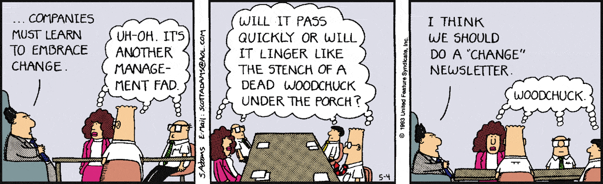
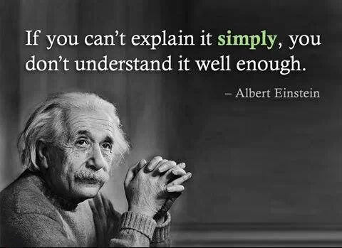

= AsciiDoc Example
Tom Zakrajsek <tzakrajsek@qdusa.com>
1.0, Nov 3, 2025: AsciiDoc Example Document
:toc: auto
// left
// right
// preamble
// macro
:toclevels: 4
:icons: font
:stem: 
:source-highlighter: rouge
:url-quickref: https://docs.asciidoctor.org/asciidoc/latest/syntax-quick-reference/

Content entered directly below the header but before the first section heading is called the preamble.

// Lines starting with // are comments and will not be rendered

Source lines starting with `//` are comments and will not be rendered

// NOTE: Requirements include:
// gem install rouge
// gem install asciidoctor-mathematical

// Build environment for the asciidoctor-mathematical gem on ubuntu 24.04:
// sudo apt install libpango1.0-dev gir1.2-pango-1.0
// sudo apt install libharfbuzz-dev gir1.2-harfbuzz-0.0
// sudo apt install gobject-introspection libgirepository1.0-dev
// sudo apt install libxml2-dev jq
// sudo apt install flex bison
// sudo apt install libgdk-pixbuf2.0-dev
// sudo gem install asciidoctor-mathematical

== Heading Examples: First level heading

This is a "normal" paragraph with a *bold* word and an _italicized_ word.

=== Second level heading

Body text under the second level heading

==== Third level heading

Body text under the third level heading

===== Fourth level heading

This text is #highlighted#

====== Fifth level heading

There are only five (5) heading levels.

== Admonitions

NOTE: *NOTE* - An admonition draws the reader's attention to auxiliary information.

Here are the other built-in admonition types:

IMPORTANT: *IMPORTANT* - Don't forget the children!

TIP: *TIP* - Look for the warp zone under the bridge.

CAUTION: *CAUTION* - Slippery when wet.

WARNING: *WARNING* - The software you're about to use is untested.

[NOTE]
====
An admonition block may also contain complex content.

.A list
- one
- two
- three

Another paragraph.
====

== References

=== Cross references

The text at the end of this sentence is cross referenced to <<_third_level_heading,the third level heading example>>

=== External references

This is a link to the https://docs.asciidoctor.org/home/[Asciidoctor documentation].
It is listed inline.  This is an attribute reference that links to the
{url-quickref}[AsciiDoc Syntax Quick Reference].
It is using an attribute reference defined in the header.

=== Footnotes

This is another paragraph.  You can also include footnotes like this.footnote:[I am footnote text and will be displayed at the bottom of the article.  Click the number to return to the reference location.]

== Lists

=== Unordered lists

.Unordered list title (optional)
* list item 1
** nested list item
*** nested nested list item 1
*** nested nested list item 2
* list item 2

=== Ordered lists
.Ordered list title (optional)
. ordered list item
.. nested ordered list item
. ordered list item

This is a paragraph.

.Example block title
====
Content in an example block is subject to normal *substitutions*.
====

.Sidebar title
****
Sidebars contain aside text and are subject to normal *substitutions*.
****

== Tables

.Table title
|===
|Column heading 1 |Column heading 2

|Column 1, row 1
|Column 2, row 1

|Column 1, row 2
|Column 2, row 2
|===

== Block types

=== Collapsible

[%collapsible]
====

Contrary to popular belief, Lorem Ipsum is not simply random text. It has roots
in a piece of classical Latin literature from 45 BC, making it over 2000 years
old. Richard McClintock, a Latin professor at Hampden-Sydney College in
Virginia, looked up one of the more obscure Latin words, consectetur, from a
Lorem Ipsum passage, and going through the cites of the word in classical
literature, discovered the undoubtable source. Lorem Ipsum comes from sections
1.10.32 and 1.10.33 of "de Finibus Bonorum et Malorum" (The Extremes of Good
and Evil) by Cicero, written in 45 BC. This book is a treatise on the theory of
ethics, very popular during the Renaissance. The first line of Lorem Ipsum,
"Lorem ipsum dolor sit amet..", comes from a line in section 1.10.32.

The standard chunk of Lorem Ipsum used since the 1500s is reproduced below for
those interested. Sections 1.10.32 and 1.10.33 from "de Finibus Bonorum et
Malorum" by Cicero are also reproduced in their exact original form,
accompanied by English versions from the 1914 translation by H. Rackham.

====

=== Quote

[quote, firstname lastname, movie title]
____
I am a block quote or a prose excerpt.
I am subject to normal substitutions, so things like *bold* and _italic_ work fine.
____

=== Verse

[verse, firstname lastname, poem title and more]
____
I am a verse block.
  Indents and endlines are preserved in verse blocks.
____

=== Code

This is a source listing for bash.  It demonstrates the use of <_n_> callouts.

[source, shell]
----
#! /bin/bash <1>
 
HOSTNAME=`uname -n`
KERNEL=`uname -r`
CPU=`uname -p`

figlet -f digital Welcome to $HOSTNAME! <2>
echo "You're running $KERNEL on $CPU"
----
<1> Hashbang is used to tell the shell which program to invoke
<2> Will fail if figlet is not installed

=== Verbatim

[#id-for-listing-block]
.Verbatim block title
----
Content in a listing block is subject to _verbatim_ *substitutions*.
Listing block content is commonly used to preserve code input.
----

== Equations

https://asciimath.org/

=== AsciMath (the default for STEM)

.A block with a basic square root using AsciiMath
[asciimath, id="myfirstequation"]
++++
sqrt(4) = 2

sum_(i=1)^n i^3=((n(n+1))/2)^2
++++

The expression in the block above can also be written inline.

stem:[sqrt(4) = 2]

and

stem:[sum_(i=1)^n i^3=((n(n+1))/2)^2]

Water (stem:[H_2O]) is a critical component.

A matrix can be written as stem:[[[a,b\],[c,d\]\]((n),(k))].

[stem]
++++
P = P_0 * ( ( (A * T_"Rt" + B - K_"sot") / (K_"tot" - K_"sot")) -1 )
++++

=== latexmath:[\LaTeX]

Inline LaTex (or latexmath:[\LaTeX]) looks like: 

latexmath:[C = \alpha + \beta Y^{\gamma} + \epsilon]

A block of LaTex looks like:

.A block of  LaTex 
[latexmath]
++++
C = \alpha + \beta Y^{\gamma} + \epsilon

++++

This is a reference back to the first equation, <<myfirstequation>>.

== Image Gallery

.Coding Horrors

.Leading?

.Understanding

.Teamwork
image::images/teamwork1.jpg[teamwork1.jpg]

.Training

